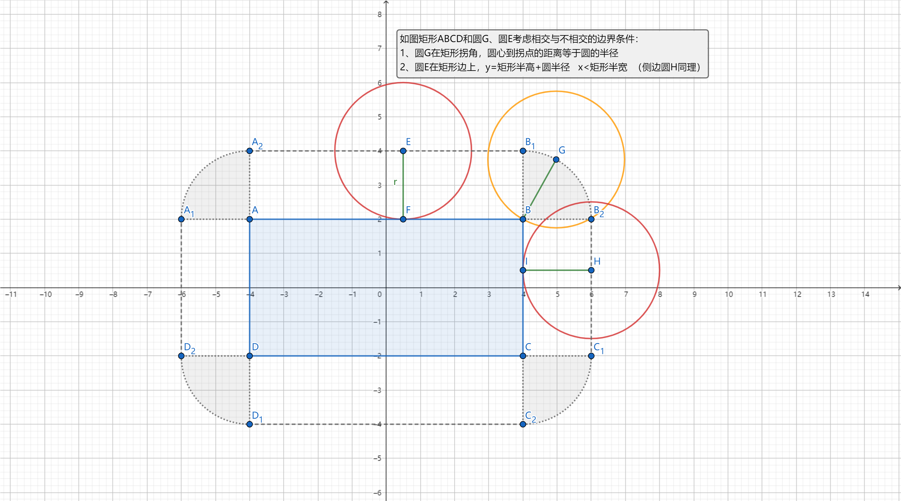
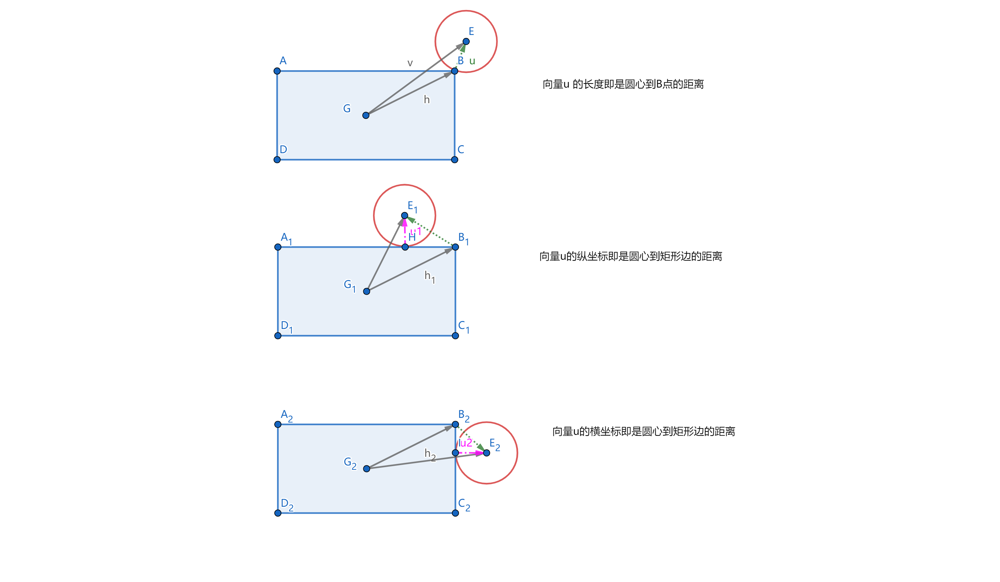
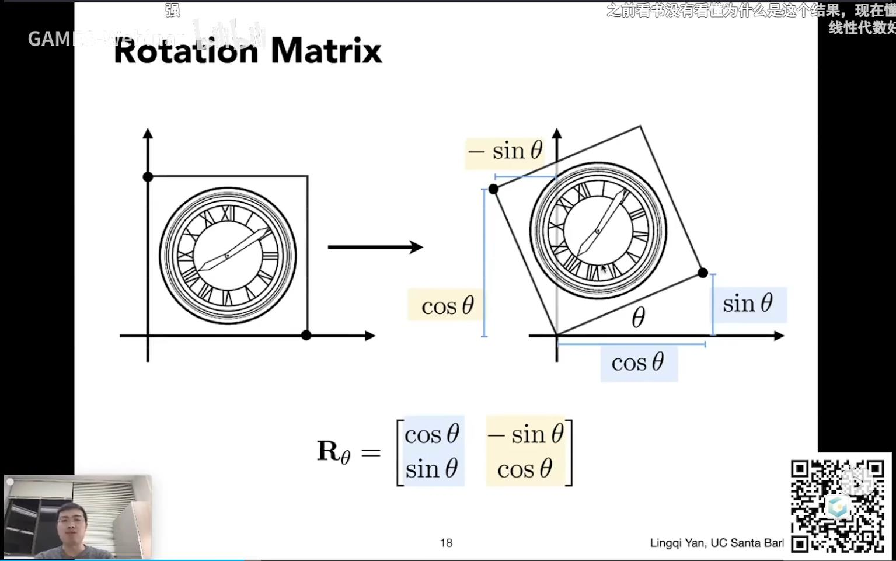
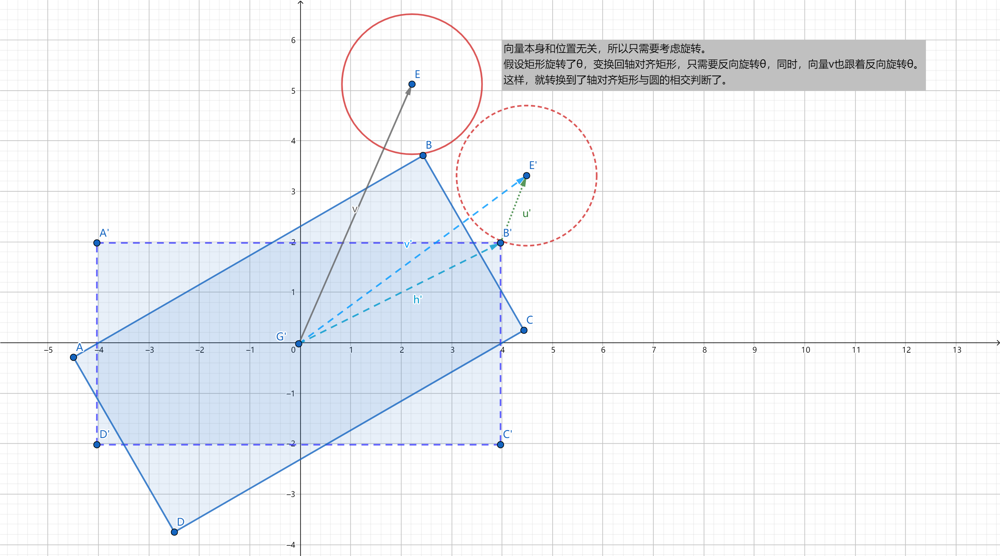

# algorithm
记录一些开发过程中遇到的算法<br>
note:<br>
unity version 2021.3.5f1c1 <br>
带编号和标题的子文件夹放的是一些例子和一些简单的测试代码<br>
核心代码都在文件夹 [Assets/Core/](/Assets/Core/) 下<br>


## 目录 <br>
****
* [001.CircleRectIntersect判断圆与矩形相交](#001.CircleRectIntersect判断圆与矩形相交)


### 001.CircleRectIntersect判断圆与矩形相交
首先讨论边和坐标轴平行的矩形和圆相交的情况。
#### 方法1：<br>
这种方法很直觉，很好理解。<br>
首先，找到相交和相离的边界条件。如下图：<br>
 <br>

想象一下，有个圆圆的轮子绕着矩形滚一圈，圆心的坐标，是不是就是边界条件？<br>
那么，<br>
假设矩形中心在坐标原点的情况下，<br>
1、当圆在拐角时的边界： `|BG| = r`  即  `x^2 + y^2 = r^2`  那么要相交也就是   `x^2 + y^2 < r^2` <br>
拐角必然是离圆心最近的顶点，分别找出离圆心最近的x,y值，即可根据`x^2 + y^2 < r^2`判断。 <br>
2、当圆在矩形上方时： `|EF| = r` 即  `y - halfH = r`  那么相交就是 `y < r + halfH` ;  <br>
显然，当圆在矩形下方时， `-y < r + halfH`; <br>
另外，圆在矩形上方/下方的充要条件是 `- halfW < x < halfW` 即  `|x| < halfW` <br>
3、当圆在在两侧时，和上下思路一样。<br>
综上，<br>
假设矩形中心点rectPos，长宽的一半halfSize，圆心circlePos，半径radius: <br>
```CS
public static bool CheckCircleRectInsert1(Vector2 rectPos, Vector2 halfSize, Vector2 circlePos, float radius)
{
    //条件1 拐角
    float minx, miny;
    //找出离圆心最近的顶点的x值
    minx = Mathf.Min(Mathf.Abs(rectPos.x + halfSize.x - circlePos.x), Mathf.Abs(rectPos.x - halfSize.x - circlePos.x));
    //找出离圆心最近的顶点的y值
    miny = Mathf.Min(Mathf.Abs(rectPos.y + halfSize.y - circlePos.y), Mathf.Abs(rectPos.y - halfSize.y - circlePos.y));
    if (minx * minx + miny * miny <= radius * radius) return true;

    //条件2 外边  
    float lenx = Mathf.Abs(rectPos.x - circlePos.x);
    float leny = Mathf.Abs(rectPos.y - circlePos.y);
    if (lenx < halfSize.x + radius && leny < halfSize.y)
        return true;
    if (leny < halfSize.y + radius && lenx < halfSize.x)
        return true;

    return false;
}
```
  
#### 方法2：<br>
这种方法比较抽象，可参考[知乎答案](https://www.zhihu.com/question/24251545) <br>
这个方法巧妙地运用了矩形的对称性质。<br>
其实，如果理解了第一种方法，方法2也就不难理解了。<br>
想象一下，类似折纸，由于矩形的对称性，可以把任意位置的圆对称到矩形的右上方（当然，也可能是正上方，正右方，或者中心）。<br>
而这个处理过程也很简单，算出矩形中心指向圆心的向量`v`，只要对`x`, `y`取绝对值即可。<br>
如下图：<br>
 <br>
本质上，该方法，也是分三种情况来理解：<br>
1、当圆在拐角时，向量`v - h`得到的向量`u`的模就是顶点到圆心的距离，所以，`|u| < r`即是相交 <br>
2、当圆在矩形上方\下方时，边界值也是矩形的宽的一半加上圆的半径。这里可以忽略`u`的`x`，那么`|u|`就是圆心到矩形边的距离了，所以，`|u| < r`即是相交 <br>
3、当圆在在两侧时，和上下思路一样。<br>
综上，方法运用向量把各种情况统一了起来：<br>
假设矩形中心点rectPos，长宽的一半halfSize，圆心circlePos，半径radius: <br>
```CS
public static bool CheckCircleRectInsert2(Vector2 rectPos, Vector2 halfSize, Vector2 circlePos, float radius)
 {
     // 第1步：转换至第1象限
     Vector2 v = new Vector2(Mathf.Abs(rectPos.x - circlePos.x), Mathf.Abs(rectPos.y - circlePos.y));
     //第2步：求圆心至矩形的最短距离矢量
     Vector2 u = Vector2.Max(v - halfSize, Vector2.zero);
     // 第3步：长度平方与半径平方比较
     return Vector2.Dot(u, u) <= radius * radius;
 }
```

接下来，看看当矩形可能发生旋转的情况。<br>
当矩形发生旋转后，一种很自然的想法就是：<br>
把圆心变换到矩形的局部空间（以矩形中心为原点，坐标轴平行于矩形的边）。<br>
这样，接着用上面的方法判断就好了。<br>
变换矩阵的构造就简单上个图：<br>
  <br>
截图来自闫令琪大神的课件：
[GAMES101 现代计算机图形学入门](https://www.bilibili.com/video/BV1X7411F744?p=3&spm_id_from=333.1007.top_right_bar_window_history.content.click&vd_source=9ac312e492d54319bc438327ffb04b0c)  <br>
```public static Matrix3x3 Get2DTRMatrix(Vector2 pos, float rot)
{
    var cos = Mathf.Cos(Mathf.Deg2Rad * rot);
    var sin = Mathf.Sin(Mathf.Deg2Rad * rot);
    var row0 = new Vector3(cos, -sin, pos.x);
    var row1 = new Vector3(sin, cos, pos.y);
    var row2 = new Vector3(0, 0, 1);
    Matrix3x3 matrix = Matrix3x3.CreateFromRows(row0, row1, row2).Inverse();
    return matrix;
}
```
`TODO  为什么要求逆才对呢？`<br>

假设矩形中心点rectPos，长宽的一半halfSize，旋转角度为radius，圆心circlePos，半径radius<br>
```CS
public static bool CheckCircleRectRotInsert(Vector2 rectPos,  Vector2 halfSize, float rectRot, Vector2 circlePos, float radius)
{
    //按行排列3x3矩阵
    var mat3x3 = Get2DTRMatrix(rectPos, rectRot);
    // ----------------
    // [row0]            
    // [row1]    点乘    [circlePos, 1] （转置）
    // [0,0,1]
    float x = mat3x3.V00 * circlePos.x + mat3x3.V01 * circlePos.y + mat3x3.V02;
    float y = mat3x3.V10 * circlePos.x + mat3x3.V11 * circlePos.y + mat3x3.V12;
    Vector2 circleLocalPos = new Vector2(x,y);

    // 注意这里转到了矩形本地坐标，那矩形中心点就是(0,0)了
    return CheckCircleRectInsert1(Vector2.zero, halfSize, circleLocalPos, radius);
    //return CheckCircleRectInsert2(Vector2.zero, halfSize, circleLocalPos, radius);
}
```
而对于方法2，还有另一种方法。<br>
因为向量有和位置无关的天然优势，所以只考虑旋转就好了。<br>
如下图：<br>

既然矩形旋转了，就想办法把它旋回去，也就是反向旋转相同的角度。把矩形中心指向圆心的向量也跟着旋转，就转换成了未旋转时的情况。<br>
```CS
public static bool CheckCircleRectRotInsert2(Vector2 rectPos, Vector2 halfSize, float rectRot, Vector2 circlePos, float radius)
{
    var dir = circlePos - rectPos;
    dir = Quaternion.AngleAxis(-rectRot, Vector3.forward) * dir;
    var v = Vector2.Max(dir, -dir);
    var u = Vector2.Max(v - halfSize, Vector3.zero);
    return Vector2.Dot(u, u) <= radius * radius;
}
```
注意：旋转的时候，分清是基于哪条轴做旋转。拎不清的话，很容易懵逼。<br>
Unity使用的世界是左手坐标系，如下图：<br>
在绕Z轴旋转时，是逆时针的，而绕X、Y轴旋转时是顺时针的。<br>

