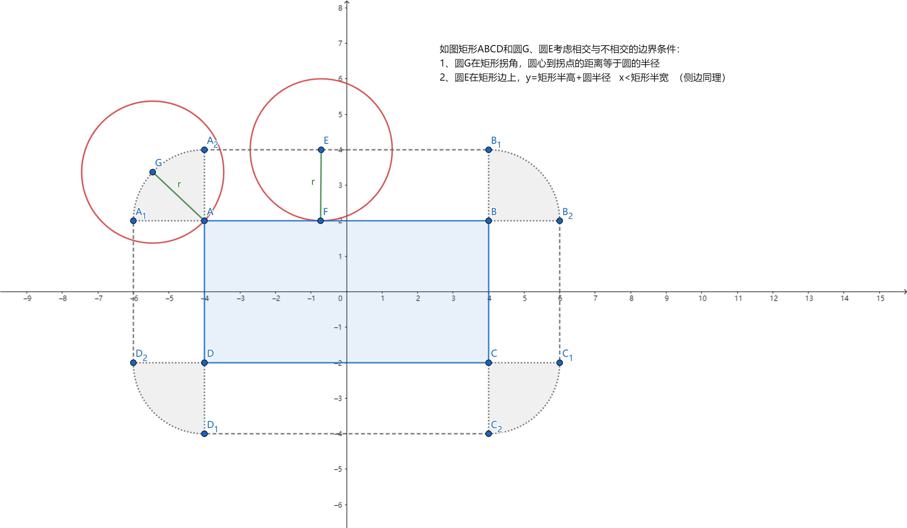

# algorithm
记录一些开发过程中遇到的算法
## 目录  
****
* [001.CircleRectIntersect 判断圆与矩形相交](#001.CircleRectIntersect判断圆与矩形相交)
* [测试](#测试)

### 001.CircleRectIntersect判断圆与矩形相交
#### 方法1： 

  
#### 方法2： 
设c为矩形中心，h为矩形半長，p为圆心，r为半径。 
方法是计算圆心与矩形的最短距离 u，若 u 的长度小于 r 则两者相交。 
这种方法比较抽象 
[参考知乎答案](https://www.zhihu.com/question/24251545)  
 

### 测试
aaa
